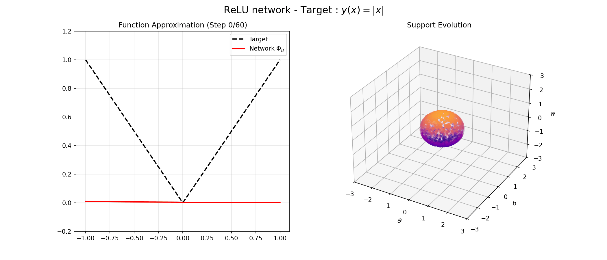
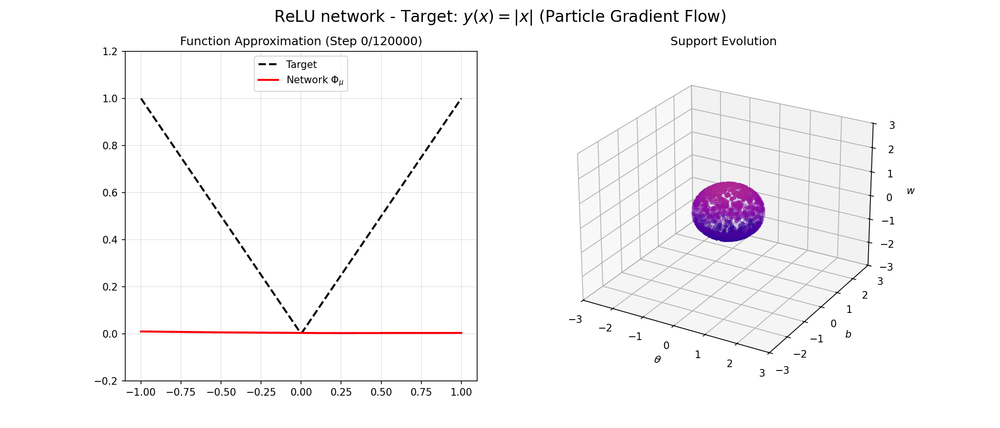
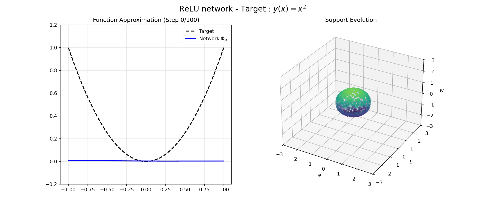
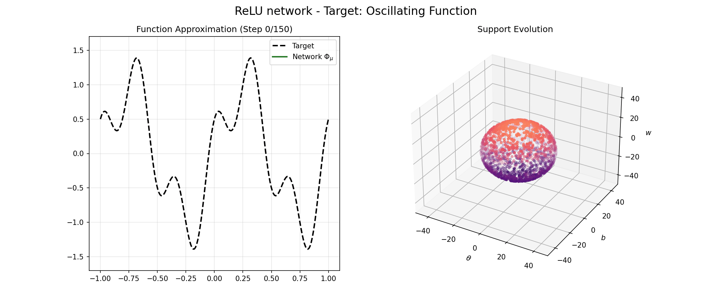
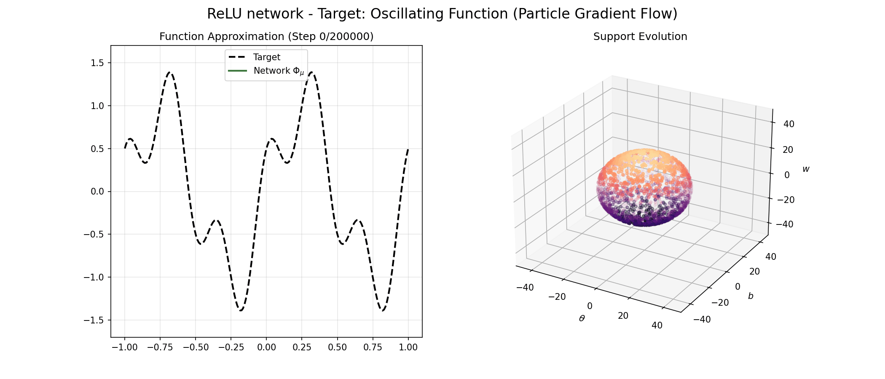
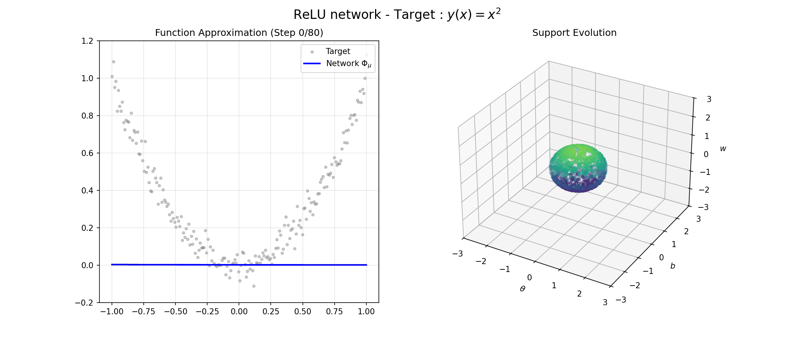
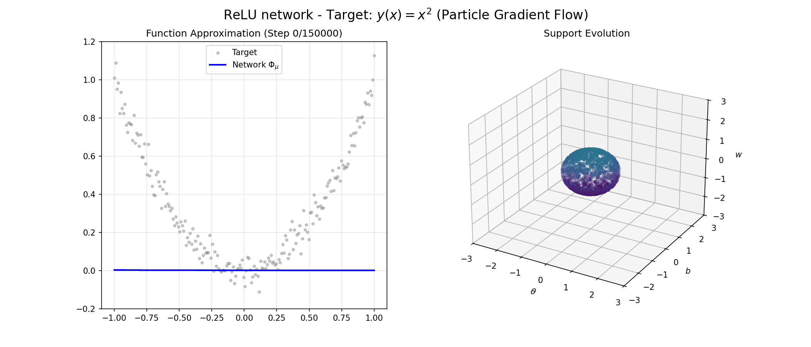
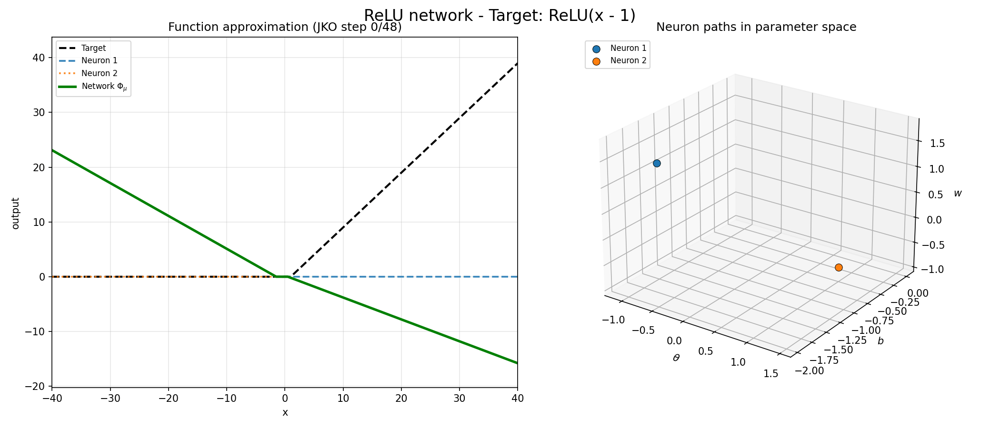
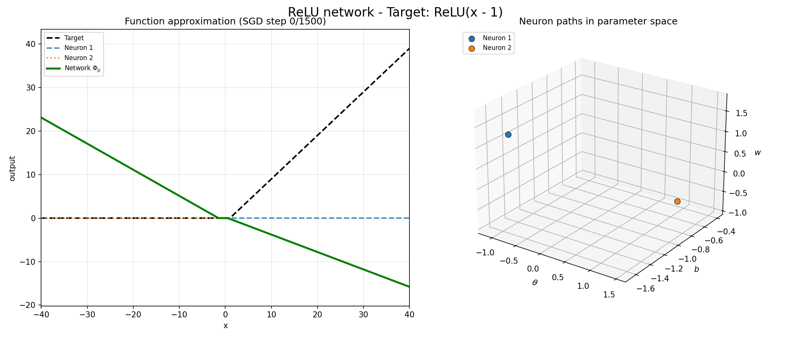

# Gradient Flows and Optimal Transport in Neural Network Training

[](https://www.python.org/downloads/)
[](https://pytorch.org/)
[](https://opensource.org/licenses/MIT)

Official repository containing the source code and numerical experiments for my Master's Thesis in Mathematics (University of Pavia, 2026).

## 🎥 Simulations

The following animations show the evolution of a ReLU network's parameters during training. I compare the **Wasserstein Gradient Flow** (approximated via the JKO scheme) with the **Particle Gradient Flow** (approximated via Full-Batch SGD).

---

### 1. Absolute Value Approximation: $y(x)=\vert x \vert$

**Wasserstein Gradient Flow (JKO)**
<p align="center">
  
</p>

**Particle Gradient Flow (SGD)**
<p align="center">
  
</p>

---

### 2. Quadratic Function Approximation: $y(x)=x^2$

**Wasserstein Gradient Flow (JKO)**
<p align="center">
  
</p>

**Particle Gradient Flow (SGD)**
<p align="center">
  
</p>

---
### 3. Oscillating Function Approximation: $y(x)=\sin(2\pi x)+\frac{1}{2}\cos(6\pi x)$

**Wasserstein Gradient Flow (JKO)**
<p align="center">
  
</p>

**Particle Gradient Flow (SGD)**
<p align="center">
  
</p>

---

### 4. Approximation with Noisy Data: $y(x)=x^2 + 0.05 \cdot Z$

**Wasserstein Gradient Flow (JKO)**
<p align="center">
  
</p>

**Particle Gradient Flow (SGD)**
<p align="center">
  
</p>

---

### 5. Transport Dynamics with Two Neurons
*Evolution of a ReLU network with only two neurons to intuitively visualize the parameter dynamics approximating the target function* $y(x)=\max\{x-1,0\}$.

**Wasserstein Gradient Flow (JKO)**
<p align="center">
  
</p>

**Particle Gradient Flow (SGD)**
<p align="center">
  
</p>

---
## 🧠 Abstract
The goal of my Master's thesis is to describe the training of shallow neural networks as a Wasserstein gradient flow. In the experiments, I chose different target functions to represent the dataset. Starting from an initial parameter distribution for the network, I simulated the time evolution of this distribution during training (i.e., the approximation of the target function) using the JKO scheme and I compared it with the evolution of the Particle Gradient Flow, simulated using the Full Batch SGD. This repository provides some simple examples of target functions, but the idea can be easily extended to more complex scenarios.

## 📂 Repository Structure
```text
master-thesis-math-2026-buccieri/
│
├── animations/               # Script generating the animations seen in this page
├── experiments/              # Scripts generating the figures included in my thesis
├── requirements.txt          # Project dependencies
└── README.md
```


## ⚙️ Requirements & Hardware

The numerical simulations rely heavily on optimal transport solvers which are optimized for GPU execution. The original experiments were conducted on **Google Colab** utilizing **NVIDIA T4** and **NVIDIA A100** GPUs. Running the JKO scheme simulations on a standard CPU is possible but will result in significantly longer execution times.

Clone the repository and install the dependencies:

```bash
git clone https://github.com/edward-f-buccieri/master-thesis-math-2026-buccieri.git
cd master-thesis-math-2026-buccieri
pip install -r requirements.txt
